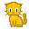
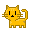
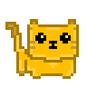
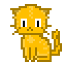
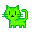

# Colors Experiment

Mint Yourself Free MoonCats in Any Color (128 Designs to Choose)

Did you know that a pixelated MoonCat has 5 colors (and 128 possible designs)?

Here's the experiment - let's try some 5-color schemes
found on the internets.

Let's try
- design 8, 9, 10, 11     - w/ Eyepatch Fur   - all 4 poses (Standing, Sleeping, Pouncing, Stalking)
- design 12, 13, 14, 15   - w/ Half/Half Fur - all 4 poses

All designs use Smile (Face) & Left (Facing). Let's do the original ~24x24 pixel size and 3x format.


**Update**

Added two new color series (V2 and CryptoCats).
What's news?

The V2 series tries to improve the original Mooncat designs and
the new CryptoCats series uses original CryptoCats designs.

See [**Mooncat Design Series**](https://github.com/cryptocopycats/design.mooncats) for more. Let's go.


## 24 Karat Gold

Let's try:

``` ruby
colorize( '24 Karat Gold', colors: [
  '#A67C00',  # Gold
  '#FFCF40',  # Sunglow
  '#FFBF00',  # Fluorescent Orange
  '#BF9B30',  # Satin Sheen Gold
  '#FFDC73',  # Crayola's Dandelion
])
```

And voila!


V2


CryptoCats









##  Vivid Green

Let's try:

``` ruby
colorize( 'Vivid Green', colors: [
  '#0AAF30', # Pantone Green
  '#2CE71E', # Neon Green
  '#66FF01', # Bright Green
  '#00CC32', # Vivid Malachite
  '#A4FF00', # Spring Bud
])
```

And voila!


V2


CryptoCats





## Valentine


Let's try:

``` ruby
colorize( 'Valentine', colors: [
  '#CE0A0A', # Venetian Red
  '#EE0E30', # Medium Candy Apple Red
  '#E71958', # Spanish Crimson
  '#EE1E87', # Electric Pink
  '#EC35B6', # Frostbite
])
```

And voila!


V2


##  Ferrari


Let's try:

``` ruby
colorize( 'Ferrari', colors: [
  '#000000',  # Black
  '#FFFFFF',  # White
  '#ED1C24',  # Pigment Red
  '#009A4E',  # Spanish Green
  '#FFF200',  # Yellow Rose
])
```

And voila!


V2


## Google

Let's try:

``` ruby
colorize( 'Google', colors: [
  '#5F6368', # Granite Gray
  '#EA4335', # Cinnabar
  '#3A81F1', # Bleu De France
  '#2DA94F', # American Green
  '#FDBD00', # Fluorescent Orange
])
```

And voila!


V2


That's it for now.


## Future Directions  - Ideas for Improvments

- Add a new "Black & White" design edition that always "hard-codes" the eyes, nose, mouth in black?

Your Ideas Here


## Questions? Comments?

Post them on the [mooncatrescue reddit](https://old.reddit.com/r/mooncatrescue). Thanks.
