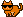

# Cool Cats Experiment

Mint Yourself Free MoonCats with Sun Glasses


Here's the experiment - let's design some sun glasses
and let's turn "plain vanilla" mooncats into cool cats with shades.


Let's use the original online pixel tool (see => [**mooncatrescue.com/pixeleditor**](https://mooncatrescue.com/pixeleditor) )
to draw all-black sun glasses in 12x3 size.


Tip: Use the print buttoin to export the pixel art into
a ready-to-cut-n-paste matrix.


Let's try:

``` ruby
shades1 = Image.parse( <<TXT, colors: ['000000'] )
1 1 1 1 1 1 1 1 1 1 1 1
0 0 1 1 1 1 0 1 1 1 1 0
0 0 0 1 1 0 0 0 1 1 0 0
TXT

shades1.save( './shades1.png' )
shades1.zoom(4).save( './shades1x4.png' )
```

Resulting in:


Let's add the shades to the first four designs (0, 1, 2, 4)
with the four poses, that is, standing (21×17),
sleeping (20×14), pouncing (17×22),
and stalking (20×21).


``` ruby
head_offsets = [
  [0,3],  # pose - standing (21×17)
  [1,3],  # pose - sleeping (20×14)
  [1,3],  # pose - pouncing (17×22)
  [0,9],  # pose - stalking (20×21)
]

## (standard/default) colors from the original online mooncat pixel drawing tool
colors = ['331a00', '663300', 'e67300', 'ffb366', 'ff9999' ]

designs = [0,1,2,3]
designs.each do |design|
  cat = Mooncats::Image.new( design: design, colors: colors )

  x, y = head_offsets[ design % 4 ]
  cat.compose!( shades1, x-1, y+2 )

  name = '%03d' % design
  cat.save( "./coolcat-#{name}_1.png" )
  cat.zoom(4).save( "./coolcat-#{name}_1x4.png" )
end
```

Resulting in:





