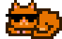
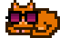
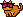
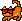
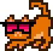
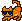
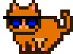
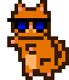

# Cool Cats Experiment

Mint Yourself Free MoonCats with Sun Glasses


Here's the experiment - let's design some sun glasses
and let's turn "plain vanilla" mooncats into cool cats with shades.


Let's use the original online pixel tool (see => [**mooncatrescue.com/pixeleditor**](https://mooncatrescue.com/pixeleditor) )
to draw all-black sun glasses in 12x3 size.


Tip: Use the print button to export the sun glasses into
a ready-to-cut-n-paste pixel matrix.


Let's try:

``` ruby
shades1 = Image.parse( <<TXT, colors: ['000000'] )
1 1 1 1 1 1 1 1 1 1 1 1
0 0 1 1 1 1 0 1 1 1 1 0
0 0 0 1 1 0 0 0 1 1 0 0
TXT

shades1.save( './shades1.png' )
shades1.zoom(4).save( './shades1x4.png' )
```

Resulting in:


Let's add the shades to the first four designs (0, 1, 2, 3)
with the four poses, that is, standing (21×17),
sleeping (20×14), pouncing (17×22),
and stalking (20×21).


``` ruby
head_offsets = [
  [0,3],  # pose - standing (21×17)
  [1,3],  # pose - sleeping (20×14)
  [1,3],  # pose - pouncing (17×22)
  [0,9],  # pose - stalking (20×21)
]

## (standard/default) colors from the original online mooncat pixel drawing tool
colors = ['331a00', '663300', 'e67300', 'ffb366', 'ff9999' ]

designs = [0,1,2,3]
designs.each do |design|
  cat = Mooncats::Image.new( design: design, colors: colors )

  x, y = head_offsets[ design % 4 ]
  cat.compose!( shades1, x-1, y+2 )

  name = '%03d' % design
  cat.save( "./coolcat-#{name}_1.png" )
  cat.zoom(4).save( "./coolcat-#{name}_1x4.png" )
end
```

Resulting in:





Let's draw and try another sunglasses design:


``` ruby
shades2 = Image.parse( <<TXT, colors: ['000000', '690C45', '8C0D5B', 'AD2160'] )
0 1 1 1 1 1 0 1 1 1 1 1
0 1 2 2 2 1 1 1 2 2 2 1
1 1 3 3 3 1 0 1 3 3 3 1
0 1 4 4 4 1 0 1 4 4 4 1
0 0 1 1 1 0 0 0 1 1 1 0
TXT

shades2.save( './shades2.png' )
shades2.zoom(4).save( './shades2x4.png' )
```

Resulting in:


And





And let's draw and try another sunglasses design:


``` ruby
shades3 = Image.parse( <<TXT, colors: ['000000', '990033', 'FF0066', 'FF3366'] )
1 1 1 1 1 1 1 1 1 1 1 1 1 1 1
0 1 1 2 2 2 2 1 2 2 2 2 1 1 0
0 0 1 3 3 3 3 1 3 3 3 3 1 0 0
0 0 1 4 4 1 1 1 1 1 4 4 1 0 0
0 0 1 1 1 1 0 0 0 1 1 1 1 0 0
TXT

shades3.save( './shades3.png' )
shades3.zoom(4).save( './shades3x4.png' )
```

Resulting in:


And










And let's draw and try another sunglasses design:


``` ruby
shades4 = Image.parse( <<TXT, colors: ['000000', '000766', '0010e6'] )
1 1 1 1 1 1 1 1 1 1 1 1
0 0 1 2 2 1 0 1 2 2 1 0
0 0 1 3 3 1 0 1 3 3 1 0
0 0 0 1 1 0 0 0 1 1 0 0
TXT

shades4.save( './shades4.png' )
shades4.zoom(4).save( './shades4x4.png' )
```

Resulting in:


And









That's it for now.  Now design your own sunglasses. Yes, you can!


<!--
## Future Directions  - Ideas for Improvments

- Paste the mooncat image into a bigger (extended) canvas before adding the sunglasses.
 Why?  On some design (with an offset of -1 or -2) some parts of the sunglasses on the left-side get "cut-off".


Your Ideas Here
-->


## Questions? Comments?

Post them on the [mooncatrescue reddit](https://old.reddit.com/r/mooncatrescue). Thanks.
