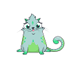
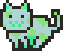
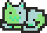
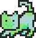
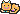
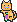
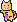
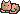
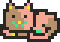

# Doppelganger Experiment

Mint Yourself Free MoonCats for Your CryptoKitties (128 Designs to Choose)

Did you know that a pixelated MoonCat has 5 colors (and 128 possible designs)?

Here's the experiment - let's turn your CryptoKitty into a free pixelated ~24x24 MoonCat doppelganger.
How? Every CryptoKitty has in its genome / dna 4 colors encoded:

1. body color
2. pattern 1 (aka highlight) color
3. pattern 2 (aka accent) color
4. eyes color

and, thus, reusing your CryptoKitty colors and choosing one of the 128 design you get a free MoonCat doppelganger.


## Kitty #979522 Doppelganger



Let's try kitty #979522.
The colors on the profile page read:

- aquamarine (base color)           - `#add5d2`
- swampgreen (highlight color)      - `#44e192`
- emeraldgreen (accent color)       - `#8be179`
- mintgreen (eye color)             - `#43edac`

And let's try
- design 8, 9, 10, 11     - w/ Eyepatch Fur   - all 4 poses (Standing, Sleeping, Pouncing, Stalking)
- design 12, 13, 14, 15   - w/ Half/Half Fur - all 4 poses

All designs use Smile (Face) & Left (Facing). Let's do the original ~24x24 pixel size and 3x format.

Let's setup the [`doppelganger`](doppelganger.rb) script:

``` ruby
doppelganger( 979522, colors: [
  '#2a2825',   # color 1  -- "black-ish" outline color
  '#8be179',   # color 2 => acc color here
  '#add5d2',   # color 3 => base color here
  '#44e192',   # color 4 => hi color here
  '#43edac'    # color 5 => eye color here
])
```

And voila!










For the record - compare to the original kitty #979522 design:


## Kitty #1925652 Doppelganger


Let's try kitty #1925652.
The colors on the profile page read:

- orangesoda (base color)          - `#f7bc56`
- royalpurple (highlight color)    - `#cf5be8`
- peach (accent color)             - `#f9cfad`
- cyan (eye color)                 - `#45f0f4`

Let's setup the [`doppelganger`](doppelganger.rb) script:

``` ruby
doppelganger( 1925652, colors: [
  '#2a2825',   # color 1  -- "black-ish" outline color
  '#f9cfad',
  '#f7bc56',
  '#cf5be8',
  '#45f0f4'
])
```

And voila!









For the record - compare to the original kitty #1925652 design:


## Kitty #1673550 Doppelganger


Let's try kitty #1673550.
The colors on the profile page read:

- salmon (base color)           - `#f4a792`
- swampgreen (highlight color)  - `#44e192`
- sandalwood (accent color)     - `#b8916c`
- gold (eye color)              - `#fcdf35`

Let's run the [`doppelganger`](doppelganger.rb) script.
And voila!








For the record - compare to the original kitty #1673550 design:


##  Future Directions - Comments Welcome

Really not too bad for a first rough quick & dirty doppelganger experiment.


Ideas for future improvements:

- The eye color does not really exist in the mooncat design.
  Change  the design (eyes always hard-coded in "black-ish" outline color 1) to use "new" color 6 (?) for eye color or better add new eye shadow (already present in some designs)?
- In the mooncat design the mouth (and nose) is NOT always hard-coded in "black-ish" outline color 1) like in the cryptokitties design BUT
uses color 5. Change the design to use color 1 for the mouth?
- Your ideas here?  Please, tell.


