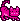
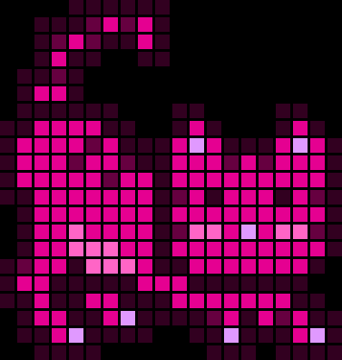
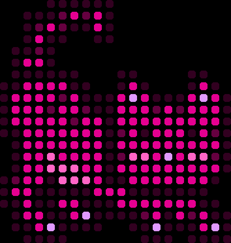
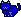
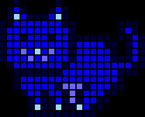
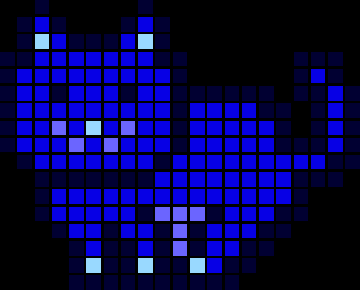
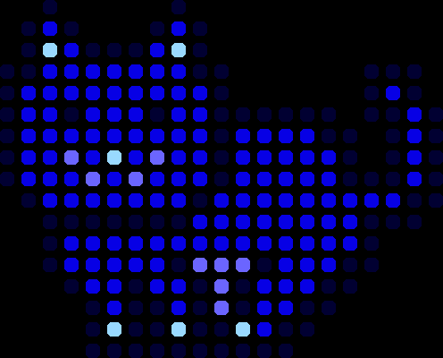

# LED Light Pixel Art Experiment


Mint yourself free MoonCats in the LED Light pixel art series.


Here's the experiment - let's turn ~24x24 pixelated MoonCats
into LED Light art.

How?

1. Let's use a black background.
2. Let's turn pixels into LEDs by scaling up the pixel (e.g. 8x).
3. Let's add spacing between the LEDs (e.g. 2 pixels).


## Mooncat 0x0077c8278d

Let's try mooncat 0x0077c8278d. Let's mint a fresh copy.


``` ruby
require 'mooncats'

cat = Mooncats::Image.mint( '0x0077c8278d' )
cat.save( './mooncat-0077c8278d.png' )
```




And let's try three LED Light variants:

1.  LED - 8 pixels, Spacing - 2 pixels   (the default)
2.  LED - 16 pixels, Spacing - 3 pixels
3.  LED - 16 pixels, Spacing - 8 pixels, Round Corner - Turned On


``` ruby
cat_led = cat.led( 8, spacing: 2 )
cat_led.save( './mooncat-0077c8278d_led8x.png' )

cat_led = cat.led( 16, spacing: 3 )
cat_led.save( './mooncat-0077c8278d_led16x.png' )

cat_led = cat.led( 16, spacing: 8, round_corner: true )
cat_led.save( './mooncat-0077c8278d_led16xr.png' )
```

And Voila!







How does it work? Let's look inside the `Image#led` method

``` ruby
def led( led=8, spacing: 2)

  width  = @img.width*led  + (@img.width-1)*spacing
  height = @img.height*led + (@img.height-1)*spacing

  img = Image.new( width, height, Color::BLACK )

  @img.width.times do |x|
    @img.height.times do |y|
      pixel = @img[x,y]
      led.times do |n|
        led.times do |m|
            img[x*led+n + spacing*x,
                y*led+m + spacing*y] = pixel
        end
      end
    end
  end
  img
end
```

The `led` method first calculates the new size of
the led image by 1) using the pixels/LED factor (e.g. 8)
and 2) adding the spacing between LEDs (e.g. 2).
The formula for the new image size (see above) is:

``` ruby
width  = @img.width*led  + (@img.width-1)*spacing
height = @img.height*led + (@img.height-1)*spacing
```

And let's try 20x21 with led - 8 pixels and spacing 2 pixels:

``` ruby
198   =  20*8 + (20-1)*2
208   =  21*8 + (21-1)*2
```

Resulting in the new size 198x208.
Next the new image gets created and pre-filled with
a black background.

``` ruby
img = Image.new( 198, 208, Color::BLACK )
```

And finally the `led` method loops over all pixels:

``` ruby
20.times do |x|      # width
  21.times do |y|    # height
    pixel = @img[x,y]
    # ...
  end
end
```

And scales ups the pixel by the
pixels/LED factor (e.g. 8)
and adds the spacing between LEDs offset (e.g. 2):

``` ruby
#...
8.times do |n|      # led (factor)
  8.times do |m|    # led (factor)
    img[x*8+n + 2*x,
        y*8+m + 2*y] = pixel
  end
end
#...
```

That's it.


## Mooncat 0x00000800fa

Let's try another mooncat 0x00000800fa.
Let's mint a fresh copy.


``` ruby
cat = Mooncats::Image.mint( '0x00000800fa' )
cat.save( './mooncat-00000800fa.png' )
```




And let's try three LED Light variants:

1.  LED - 8 pixels, Spacing - 2 pixels   (the default)
2.  LED - 16 pixels, Spacing - 3 pixels
3.  LED - 16 pixels, Spacing - 8 pixels, Round Corner - Turned On


``` ruby
cat.led(  8, spacing: 2 ).save( './mooncat-00000800fa_led8x.png' )
cat.led( 16, spacing: 3 ).save( './mooncat-00000800fa_led16x.png' )
cat.led( 16, spacing: 8, round_corner: true ).save( './mooncat-00000800fa_led16xr.png' )
```

And Voila!









##  Future Directions - Comments Welcome

Really not too bad for a first rough quick & dirty LED light experiment.


Ideas for future improvements:

- Scale-up pixels not as rectangles but as circles?
- Use different shaded colors for scaled-up pixels?
- Use a background off by 1 for each scaled-up pixel for a neon "glowing" light effect?
- Your ideas here?  Please, tell.


## Questions? Comments?

Post them on the [mooncatrescue reddit](https://old.reddit.com/r/mooncatrescue). Thanks.
