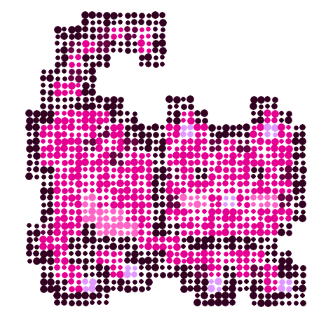

# MoonCat Art Challenge #1 Experiment -  Dotty Spotty "Currency" MoonCats Inspired by Damien Hirst's "The Currency"


See
the [**Punk Art Challenge #1**](https://old.reddit.com/r/CryptoPunksDev/comments/pttf4s/punk_art_challenge_1_10_000_dotty_spotty_currency/)
for more background
and change ~Punk~ to MoonCat :-).


Okkie. Welcome back.
Let's give it a try using
the mooncat   0x0077c8278d.


Let's start with 10px circles -
resulting in a 24*10px = 240×240px format:


``` ruby
mooncat.spots( 10 )
```


Let's try a 2x zoom with quadruple (2×2=4) the pixel
and a random circle radius
between 3px and 6px
and a random x/y-offset from the circles center by +/-1px:


``` ruby
mooncat.zoom(2).spots( 5, spacing: 5,
                          center: [-1,1], radius: [3,6] )
```




                          .save( './tmp/spots-0077c8278d@2x.png' )

```


img = Pixelart::Image.new( 24, 24 )
# 20x21  - place in 24x24 canvas
#  add x-offset +2, y-offset +1
img.compose!( Pixelart::Image.read( './tmp/mooncat-0077c8278d.png' ), 2, 1 )

img.spots( 10 ).save( './tmp/spots-0077c8278d.png' )
img.zoom(2).spots( 5, spacing: 5,
                      center: [-1,1], radius: [3,6] ).save( './tmp/spots-0077c8278d@2x.png' )


